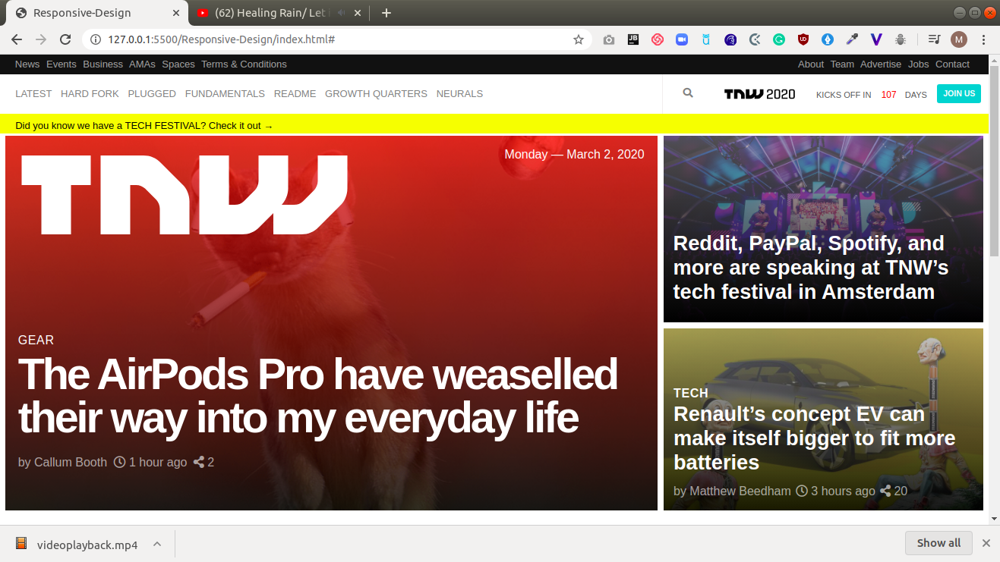

# Responsive-Design

This is the sixth project of the Main HTML/CSS curriculum at [Microverse](https:www.microverse.org/) - @microverseinc

# Responsive-Design ([The Odin Project]( https://www.theodinproject.com/courses/html5-and-css3/lessons/building-with-responsive-design))

## Built With

- HTML5 
- CSS3

## Live Demo

[Live Demo](https://rawcdn.githack.com/chindrop/Responsive-Design/d3181321e48f1d8d69ef0f7b8e727cda706a22d2/index.html)

## Authors

👤 

**Caleb Apronti**

- Github: [@chindrop](https://github.com/chindrop)

👤 **Marylene Sawyer**
- Github: [@Bluette1](https://github.com/Bluette1)

## 📝 License

This project is [MIT](https://opensource.org/licenses/MIT) licensed.